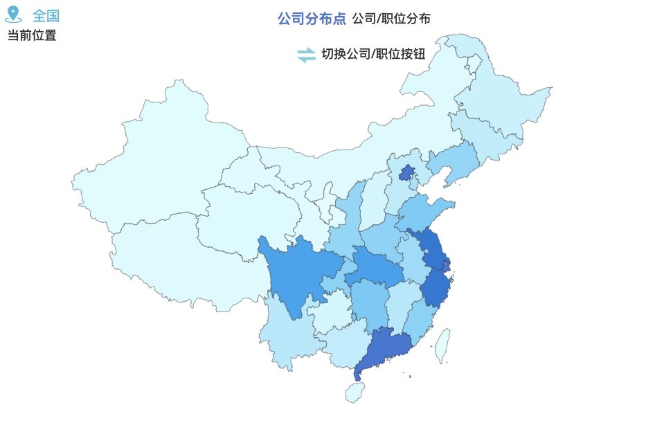
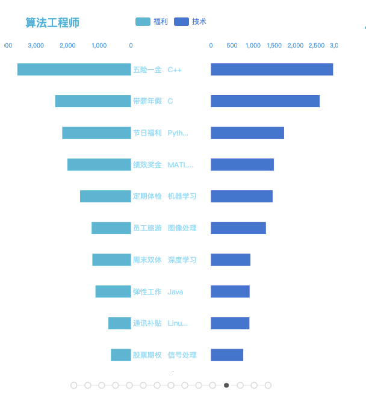
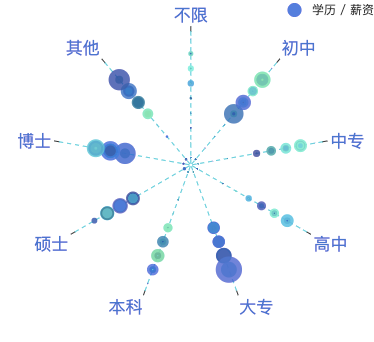
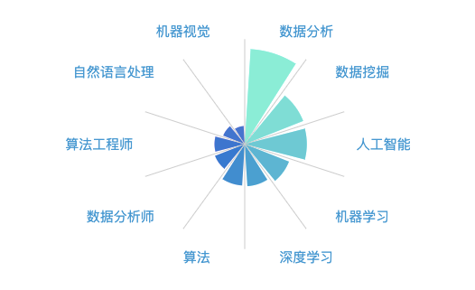
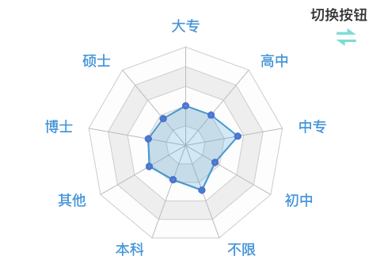
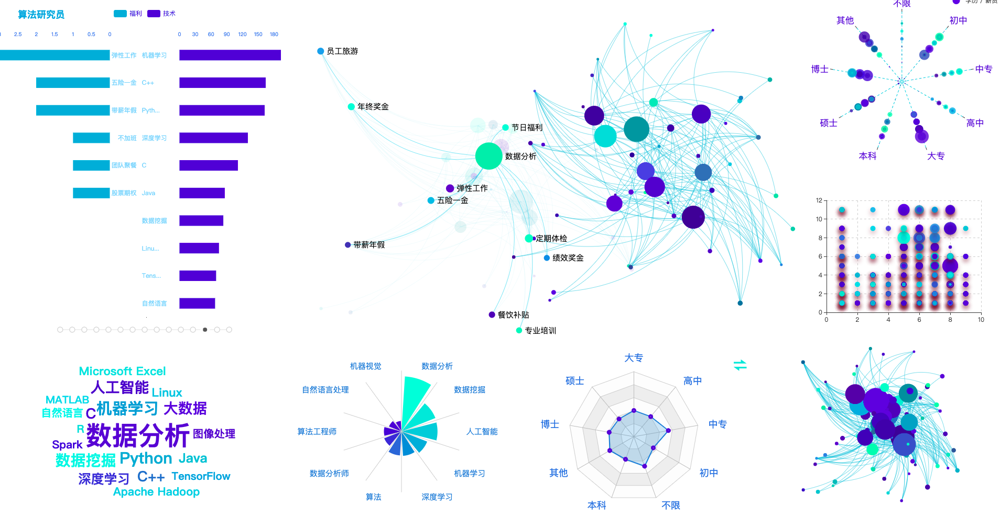

##操作说明

### 1、地图

```地图
1、使用鼠标移动在地图的每一个省级单位，回获取该省级招聘的简要信息
2、在地图上方单击切换按钮;地图的数据;会按照默认的公司数量切换到职位数
3、单击地图的省级单位，会获取当前省所用的招聘信息，再次单击相同的省级单位会切换回全国的
	招聘信息
```



---

### 2、时间轴

```--
1、时间轴图默认回显示全国前十职位技能点和福利,时间的推移会自动切换到下一个职位，在
	单击地图某一个省时，会切换到该省的职位前十的技能点和福利
```



---

### 3、散点图S

#### 一

```
1、散点图一，默认显示全国学历/经验以及薪资的关系,当鼠标移动到某一个圆点,会显示该圆点
	的详细信息,在单击地图的省时,会切换到该省的招牌信息
2、双击组件时，会放大显示，以便观看，会覆盖地图,再次双击放大后的组件,会切换至地图显示
```



#### 二、

```
1、散点图二，该组件显示学历和工作经验的关系，,在地图中单击省级单位时,会切换到该省的信息
2、双击组件时，会放大显示，以便观看，会覆盖地图,再次双击放大后的组件,会切换至地图显示
3、
		0	不限   1	初中   2	中专   3	高中   4	大专
		5	本科   6	硕士   7	博士   8	其他
```


---

### 4、词云

```
1、该组件默认显示全国的职位前几位的职业信息,在地图中单击省级单位时,会切换到该省的职位前几位
信息
```


---

### 5、极坐标系下的堆叠柱状图

```
1、该组件默认显示全国的排名前十的职位信息，当鼠标移动到某一个数据轴上，会显示该职位的详细信息
	在地图中单击省级单位时,会切换到该省的职位前十位信息
2、双击组件时，会放大显示，以便观看，会覆盖地图,再次双击放大后的组件,会切换至地图显示
```




---

### 6、雷达图

```雷达图lei d
1、该组件默认显示全国学历/经验信息(使用右上角的切换按钮),鼠标移动到某个数据点上会显示该
	点的详细信息，在地图中单击省级单位时,会切换到该省的对应信息
2、双击组件时，会放大显示，以便观看，会覆盖地图,再次双击放大后的组件,会切换至地图显示
```



---

### 7、关系图

```关系图
1、该组件默认会显示职位需求/职位福利前十的关系,当鼠标移动到某一个小点,会显示对应的关系
	使用鼠标单击某一个图，可以拖动该图的位置，或者使用滚轮滚动会放大/缩小该图的显示效果,
	在地图中单击省级单位时,会切换到该省的对应信息。
2、双击组件时，会放大显示，以便观看，会覆盖地图组件,再次双击放大后的组件,会切换至地图组件
```


### 8、部分组件放大显示效果

